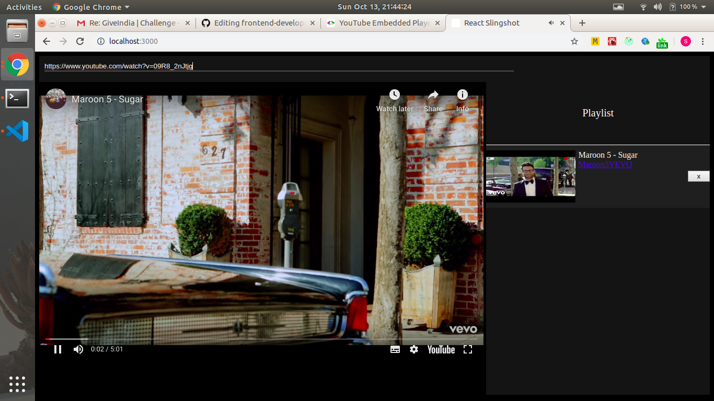

## Frontend Developer at Give

Sample UI below. The app doesn't need to have fancy design. We are looking for functional implementation.

### Tasks
- [x] The application must be a SPA.(Done using react)
- [x] The application should allow user to add a youtube link to the playlist and start playing songs from the playlist first in first out.(Just paste the URL and press Enter)
- [x] Once a song is finished, it should be removed from the playlist.
- [x] The youtube link must be validated by the app for proper url format before adding to the queue.

### Bonus

- [x] Allow the user to remove 
- [ ] Reorder items in the playlist.
- [x] Sync different versions of the application. If the application is open across two tabs, both must be in sync for all activities. (Add Remove Working across two tabs)
- [ ] Seeking across tabs (not Working)
-

### Run Commands
- npm install OR yarn
- npm run start OR yarn start

[My Resume](https://drive.google.com/file/d/1i45hPdBMWk6oUeTmkfflFWB_eMynLZjP/view?usp=sharing)

